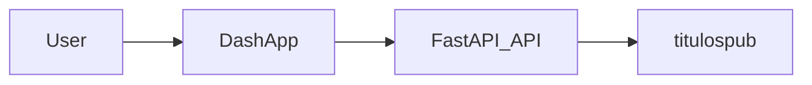

## Calculadora de Títulos Públicos

Sistema profissional para **cálculo e análise de títulos públicos brasileiros** usando:

- **Camada de domínio** (`titulospub`) com toda a lógica de cálculo.
- **API REST** em **FastAPI** (`api`) para acesso programático.
- **Interface web interativa** em **Dash** (`dash_app`) consumindo apenas a API.

### Arquitetura (3 camadas)

```text
calculadora_titulos_publicos/
├── titulospub/              # Domínio: cálculos e dados de mercado
├── api/                     # API FastAPI (HTTP)
├── dash_app/                # Frontend Dash (UI)
├── run_api.py               # Sobe somente a API
├── run_dash_app.py          # Sobe somente o Dash
├── run_all_dev.py           # (dev) Sobe API + Dash juntos
├── requirements.txt         # Dependências
├── pyproject.toml / setup.py# Empacotamento de `titulospub`
└── teste_calculadora_titulospub.ipynb  # Notebook de exemplo (opcional)
```

Fluxo de uso:



- `titulospub/` **não** depende de FastAPI nem de Dash.
- `api/` importa `titulospub` e expõe os cálculos via HTTP.
- `dash_app/` consome **apenas** a API via HTTP (não importa `titulospub` diretamente).

---

## Instalação

Recomendado usar ambiente virtual.

```bash
git clone <URL_DO_REPOSITORIO>
cd calculadora_titulos_publicos

python -m venv .venv
# Windows
.venv\Scripts\activate
# Linux/macOS
source .venv/bin/activate

pip install -r requirements.txt
pip install -e .
```

O `requirements.txt` inclui o pacote **`brazilian_bonds_db`** via repositório irmão (`../brazil_fixed_income_analytics`). Mantenha esse clone ao lado deste projeto.

Após isso, o pacote `titulospub` pode ser importado normalmente em Python e no notebook.

### Dados de mercado (`.env`)

Paths do lake e do SQLite são configurados na raiz do repositório:

```bash
# Windows
copy .env.example .env
# Linux/macOS
cp .env.example .env
```

Edite `.env` se os caminhos da sua máquina forem diferentes. O arquivo `.env` **não** é versionado.

| Variável | Uso |
|----------|-----|
| `BBDB_DATA_ROOT` | Raiz do projeto / `data_root` em `bbdb.update(...)` |
| `BBDB_DB_PATH` | Caminho do SQLite (`bbdb.read_data(db_path=...)`) |

O módulo [`titulospub/dados/db_reader.py`](titulospub/dados/db_reader.py) carrega o `.env` automaticamente e expõe `get_repo_root()`, `get_db_path()` e `get_reader()`.

Exemplo (materializar ou ler dados):

```python
import brazilian_bonds_db as bbdb
from titulospub.dados.db_reader import get_repo_root, get_db_path, get_reader

bbdb.update(data_root=str(get_repo_root()))
reader = get_reader()  # usa BBDB_DB_PATH do .env
```

> **Nota:** `*.db` está no `.gitignore` — cada ambiente materializa `database/app.db` localmente. Os testes de regressão (`pytest -m regression`) rodam **offline** com fixtures e não exigem o banco.

**Python:** o pacote `brazilian_bonds_db` requer **Python ≥ 3.10**.

### Vencimentos e cache de mercado

[`titulospub/dados/vencimentos.py`](titulospub/dados/vencimentos.py) lê listas de vencimentos via `VariaveisMercado.get_anbimas()` e `get_bmf()` (pickles em `cache_data/` ou banco na primeira carga). Para ANBIMA/BMF, chamadas **sem** `data` usam **D-1 útil** quando a sessão é o dia corrente.

| Sintoma | Causa provável | Ação |
|---------|----------------|------|
| `GET /vencimentos/*` retorna `[]` | Cache vazio ou gold ausente na data de leitura | Rodar `POST /atualizar-mercado` ou reiniciar a API (lifespan chama `atualizar_tudo`) |
| Logs `[WARN] … nao encontrado em anbimas_dict` | Chaves do gold diferentes de `LTN`, `LFT`, `NTN-B`, `NTN-F` | Corrigir normalização em [`transforms/anbimas.py`](titulospub/dados/transforms/anbimas.py) |
| DI sem códigos | `ajustes_bmf` sem tickers `DI1*` | Materializar gold BMF; ver [`transforms/bmf.py`](titulospub/dados/transforms/bmf.py) |

**Verificação local (offline + opcional DB):**

```bash
pytest tests/titulospub/dados/test_vencimentos_regressao.py tests/api/test_vencimentos_endpoint.py -m regression -v
python scripts/verify_vencimentos_contrato.py          # fixtures
python scripts/verify_vencimentos_contrato.py --db     # exige .env e app.db materializado
```

Baseline de regressão: `tests/fixtures/golden/vencimentos_baseline.json` (`data_base=2026-05-25` — 12/17/15/6 vencimentos e 47 códigos DI).

---

## Como rodar em desenvolvimento

### 1. Rodar somente a API (FastAPI)

```bash
python run_api.py
```

A API ficará disponível em:

- `http://localhost:8000`
- Documentação Swagger: `http://localhost:8000/docs`
- Documentação ReDoc: `http://localhost:8000/redoc`

**Workers (API):**

- Por padrão, `run_api.py` usa **1 worker**, adequado para desenvolvimento.
- Para aumentar, defina a variável de ambiente:

```bash
set API_WORKERS=4      # Windows (cmd)
export API_WORKERS=4   # Linux/macOS
python run_api.py
```

> Atenção: carteiras hoje usam estado em memória, então múltiplos workers podem ter limitações.

### 2. Rodar somente o Dash

Requer a API rodando em `http://localhost:8000` (ou conforme configurado em `dash_app/config.py`).

```bash
python run_dash_app.py
```

Por padrão, a interface estará em:

- `http://127.0.0.1:8050`

Variáveis de ambiente suportadas:

- `DEBUG` (`True` / `False`) – modo debug do Dash (padrão: `False`).
- `DASH_HOST` – host para o servidor (padrão: `0.0.0.0`).
- `DASH_PORT` – porta do servidor (padrão: `8050`).
- `API_BASE_URL` – URL da API (padrão: `http://127.0.0.1:8000`; ver [`dash_app/config.py`](dash_app/config.py)).
- `CONSULTAS_DB_TIMEOUT` – timeout em segundos para consultas/export CSV no explorer (padrão: `120`).

Exemplos:

```bash
set DEBUG=True
set DASH_PORT=8051
python run_dash_app.py
```

### 3. Rodar API e Dash juntos (desenvolvimento)

Para conveniência em ambiente local, há um script que sobe **API e Dash ao mesmo tempo**:

```bash
python run_all_dev.py
```

Comportamento:

- Inicia `run_api.py` e `run_dash_app.py` em subprocessos separados.
- Mantém os dois processos rodando até você pressionar **Ctrl+C**.
- Ao interromper, tenta encerrar os subprocessos de forma limpa.

> **Importante:** `run_all_dev.py` é pensado **apenas para desenvolvimento local**.  
> Em produção, use um servidor de aplicações adequado (por exemplo, `uvicorn`/`gunicorn` para a API FastAPI) e configure o Dash de forma separada.

---

## Uso direto do pacote `titulospub`

Além da API, você pode usar o núcleo de cálculo diretamente em Python:

```python
from titulospub import NTNB, LTN, LFT, NTNF, equivalencia

# Criar título LTN
ltn = LTN("2025-01-01", taxa=12.5)
ltn.quantidade = 50_000
print(f"Financeiro: R$ {ltn.financeiro:,.2f}")

# Calcular equivalência entre títulos
eq = equivalencia(
    "LTN", "2025-01-01",
    "NTNB", "2035-05-15",
    qtd1=10_000,
    criterio="dv",
)
print("Equivalência (qtd NTNB):", eq)
```

Para um fluxo mais completo de testes manuais da calculadora, você pode usar o notebook:

- `teste_calculadora_titulospub.ipynb`

Abra-o em Jupyter/VSCode após instalar as dependências e execute as células em ordem.

---

## API – endpoints principais

Alguns endpoints expostos pela API FastAPI (ver documentação em `/docs`):

- **Títulos individuais**
  - `POST /titulos/ltn` – criar título LTN
  - `POST /titulos/lft` – criar título LFT
  - `POST /titulos/ntnb` – criar título NTNB
  - `POST /titulos/ntnb/hedge-di` – calcular hedge DI de NTNB
  - `POST /titulos/ntnf` – criar título NTNF

- **Carteiras**
  - `POST /carteiras/{tipo}` – criar carteira (ltn, lft, ntnb, ntnf)
  - `GET /carteiras/{carteira_id}` – obter dados da carteira
  - `PUT /carteiras/{carteira_id}/taxa` – atualizar taxa de um título
  - `PUT /carteiras/{carteira_id}/dias` – atualizar dias de liquidação

- **Outros**
  - `POST /equivalencia` – equivalência entre títulos
  - `GET /vencimentos/{tipo}` – listar vencimentos disponíveis
  - `GET /health`, `/ready`, `/live` – health/readiness/liveness checks

- **Consultas DB** (explorer do gold — ver seção abaixo)
  - `GET /consultas-db/catalogo` – catálogo de tabelas e colunas permitidas
  - `GET /consultas-db/status` – diagnóstico do SQLite (`db_path`, `db_existe`)
  - `POST /consultas-db/consultar` – preview dos dados (JSON)
  - `POST /consultas-db/exportar-csv` – exportação CSV do recorte

### Consultas ao banco

Explorer interativo do SQLite gold materializado pelo **`brazilian_bonds_db`** (`app.db`). Permite escolher tabela, colunas e período, visualizar um preview e baixar CSV — **sem** disparar cálculos de título.

Este fluxo é **independente** de `VariaveisMercado` e dos endpoints de LTN/LFT/NTNB/NTNF. Os dados retornados são o gold bruto do `bbdb`, não o contrato ANBIMA usado nos cálculos.

**Pré-requisitos**

- `.env` com `BBDB_DB_PATH` e `BBDB_DATA_ROOT` (seção [Dados de mercado](#dados-de-mercado-env) acima).
- Banco materializado localmente (`*.db` não é versionado):

```python
import brazilian_bonds_db as bbdb
from titulospub.dados.db_reader import get_repo_root, get_reader

bbdb.update(data_root=str(get_repo_root()))
reader = get_reader()  # usa BBDB_DB_PATH do .env
```

- Verificar disponibilidade: `GET http://localhost:8000/consultas-db/status` (`db_existe`, `db_path`).

**Interface Dash**

- Rota: `http://127.0.0.1:8050/consultas-db` (item **Consultas DB** na navbar).
- Requer API em execução (`python run_api.py` ou `python run_all_dev.py`).

**Formato na interface (pt-BR)**

| Aspecto | Comportamento |
|---------|---------------|
| Números no preview | Milhar `.`, decimal `,` (ex.: `1.234,567`; `0,12`) |
| Datas no preview | `DD/MM/YYYY` |
| Contagens (meta, alertas) | Mesmo locale (ex.: `Exibindo 5.000 de 12.345 linhas`) |
| JSON da API | Números e datas ISO — formatação aplicada só no Dash |

A formatação do preview usa `dash_app/utils/formatacao_pt_br.py` (espelho de `titulospub/dados/consultas_db/formatacao.py`; o Dash **não** importa `titulospub`).

**Preview interativo (após Consultar)**

| Recurso | Escopo |
|---------|--------|
| Filtro por coluna | Client-side na DataTable (linha de filtro abaixo dos cabeçalhos) |
| Ordenação | Clique no cabeçalho (sobre strings formatadas; ordem lexicográfica) |
| **Colunas** (card) | Define colunas enviadas à API e incluídas no CSV |
| **Colunas visíveis no preview** | Oculta/exibe colunas na grade sem nova consulta |

Filtros e colunas ocultas valem **somente** para o preview. O CSV reflete a consulta completa (tabela, colunas e período selecionados no card).

**Formato do CSV exportado**

| Aspecto | Valor |
|---------|--------|
| Encoding | UTF-8 com BOM |
| Separador de campos | `;` (abre corretamente no Excel pt-BR) |
| Números | Milhar `.`, decimal `,` |
| Datas | `DD/MM/YYYY` |
| Geração | Somente `exportar_csv()` em `titulospub/dados/consultas_db/` |

Exemplo:

```csv
data_referencia;cdi
01/01/2024;0,12
```

> **Breaking change (Spec 004):** versões anteriores usavam separador `,`, datas ISO e decimal com ponto. Scripts que parseavam o CSV antigo devem usar `;` e locale pt-BR.

**Corpo típico do POST** (`/consultas-db/consultar` e `/consultas-db/exportar-csv`):

```json
{
  "tabela": "cdi",
  "colunas": ["data_referencia", "cdi"],
  "data_inicio": "2024-01-01",
  "data_fim": "2024-12-31"
}
```

Tabelas em modo `snapshot` (`titulos_publicos`, `contratos_bmf`) não exigem datas; snapshots com `coluna_data` (`feriados`) aceitam filtro opcional.

**Limites (v1)**

| Parâmetro | Valor |
|-----------|-------|
| Preview máximo | 5.000 linhas |
| Exportação CSV máxima | 500.000 linhas |
| Intervalo de datas | Livre; ajustado à interseção com min/max no banco |
| Timeout Dash → API (consultas/CSV) | 120 s (`CONSULTAS_DB_TIMEOUT`) |

Se o período pedido for maior que o disponível no SQLite, a API **ajusta** o intervalo e retorna aviso (`intervalo_ajustado`, `mensagem_aviso`). Se não houver interseção, retorna **422** informando as datas disponíveis. O catálogo (`GET /consultas-db/catalogo`) inclui `data_disponivel_inicio` / `data_disponivel_fim` por fonte.

Tabelas de alto volume (`mercado_secundario`, `liquidacoes_mercado`, `mercado_com_liquidacoes`): a UI exibe aviso quando o intervalo selecionado é maior que 30 dias.

**Arquitetura**

```text
Dash → API → titulospub/dados/consultas_db → get_reader() → app.db
```

O Dash **não** importa `titulospub`; toda regra de consulta fica no domínio (`titulospub/dados/consultas_db/`).

**Testes automatizados** (não exigem `app.db` em CI):

```bash
pytest tests/titulospub/dados/test_consultas_db*.py \
       tests/titulospub/dados/test_consultas_db_formatacao.py \
       tests/dash_app/test_formatacao_pt_br.py \
       tests/dash_app/test_consultas_db_preview.py \
       tests/api/test_consultas_db_endpoint.py -v
pytest tests/ -m regression -v
```

Especificações:

- Explorer base: [`specs/003-consulta-db-explorer/003-consulta-db-explorer.md`](specs/003-consulta-db-explorer/003-consulta-db-explorer.md)
- UX pt-BR, CSV e tabela interativa: [`specs/004-consulta-db-ux-formatacao/004-consulta-db-ux-formatacao.md`](specs/004-consulta-db-ux-formatacao/004-consulta-db-ux-formatacao.md)

> **Segurança (v1):** a API não exige autenticação; o explorer expõe leitura do gold para quem tiver acesso à rede da API. Autenticação multi-tenant está fora do escopo desta versão.

---

## Pastas e arquivos não essenciais (podem ser removidos)

Para ter um repositório **mínimo** focado apenas no produto (domínio + API + Dash), você pode remover ou ignorar pastas/arquivos de suporte que não são necessários para rodar o app em produção, como por exemplo:

- Antigas versões de domínio ou refactors experimentais (`titulospub_domain/`, se ainda existir).
- Estruturas de banco de dados, ETL e scripts auxiliares (`db/`, `data/`, `database/`, jobs específicos).
- Conjuntos extensos de testes ou notebooks exploratórios que não façam parte do fluxo oficial.
- Documentações internas muito detalhadas (arquivos markdown adicionais, pastas de `explain/` etc.).

Este README descreve **apenas o núcleo estável** que deve ser mantido para subir a aplicação em um servidor e disponibilizar a calculadora para usuários finais.
