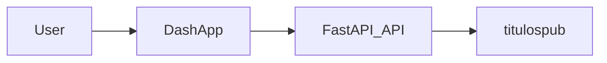

## Calculadora de Títulos Públicos

Sistema profissional para **cálculo e análise de títulos públicos brasileiros** usando:

- **Camada de domínio** (`titulospub`) com toda a lógica de cálculo.
- **API REST** em **FastAPI** (`api`) para acesso programático.
- **Interface web interativa** em **Dash** (`dash_app`) consumindo apenas a API.

### Arquitetura (3 camadas)

```text
calculadora_titulos_publicos/
├── titulospub/              # Domínio: cálculos e dados de mercado
├── api/                     # API FastAPI (HTTP)
├── dash_app/                # Frontend Dash (UI)
├── run_api.py               # Sobe somente a API
├── run_dash_app.py          # Sobe somente o Dash
├── run_all_dev.py           # (dev) Sobe API + Dash juntos
├── requirements.txt         # Dependências
├── pyproject.toml / setup.py# Empacotamento de `titulospub`
└── teste_calculadora_titulospub.ipynb  # Notebook de exemplo (opcional)
```

Fluxo de uso:



- `titulospub/` **não** depende de FastAPI nem de Dash.
- `api/` importa `titulospub` e expõe os cálculos via HTTP.
- `dash_app/` consome **apenas** a API via HTTP (não importa `titulospub` diretamente).

---

## Instalação

Recomendado usar ambiente virtual.

```bash
git clone <URL_DO_REPOSITORIO>
cd calculadora_titulos_publicos

python -m venv .venv
# Windows
.venv\Scripts\activate
# Linux/macOS
source .venv/bin/activate

pip install -r requirements.txt
pip install -e .
```

O `requirements.txt` inclui o pacote **`brazilian_bonds_db`** via repositório irmão (`../brazil_fixed_income_analytics`). Mantenha esse clone ao lado deste projeto.

Após isso, o pacote `titulospub` pode ser importado normalmente em Python e no notebook.

### Dados de mercado (`.env`)

Paths do lake e do SQLite são configurados na raiz do repositório:

```bash
# Windows
copy .env.example .env
# Linux/macOS
cp .env.example .env
```

Edite `.env` se os caminhos da sua máquina forem diferentes. O arquivo `.env` **não** é versionado.

| Variável | Uso |
|----------|-----|
| `BBDB_DATA_ROOT` | Raiz do projeto / `data_root` em `bbdb.update(...)` |
| `BBDB_DB_PATH` | Caminho do SQLite (`bbdb.read_data(db_path=...)`) |

O módulo [`titulospub/dados/db_reader.py`](titulospub/dados/db_reader.py) carrega o `.env` automaticamente e expõe `get_repo_root()`, `get_db_path()` e `get_reader()`.

Exemplo (materializar ou ler dados):

```python
import brazilian_bonds_db as bbdb
from titulospub.dados.db_reader import get_repo_root, get_db_path, get_reader

bbdb.update(data_root=str(get_repo_root()))
reader = get_reader()  # usa BBDB_DB_PATH do .env
```

> **Nota:** `*.db` está no `.gitignore` — cada ambiente materializa `database/app.db` localmente. Os testes de regressão (`pytest -m regression`) rodam **offline** com fixtures e não exigem o banco.

**Python:** o pacote `brazilian_bonds_db` requer **Python ≥ 3.10**.

---

## Como rodar em desenvolvimento

### 1. Rodar somente a API (FastAPI)

```bash
python run_api.py
```

A API ficará disponível em:

- `http://localhost:8000`
- Documentação Swagger: `http://localhost:8000/docs`
- Documentação ReDoc: `http://localhost:8000/redoc`

**Workers (API):**

- Por padrão, `run_api.py` usa **1 worker**, adequado para desenvolvimento.
- Para aumentar, defina a variável de ambiente:

```bash
set API_WORKERS=4      # Windows (cmd)
export API_WORKERS=4   # Linux/macOS
python run_api.py
```

> Atenção: carteiras hoje usam estado em memória, então múltiplos workers podem ter limitações.

### 2. Rodar somente o Dash

Requer a API rodando em `http://localhost:8000` (ou conforme configurado em `dash_app/config.py`).

```bash
python run_dash_app.py
```

Por padrão, a interface estará em:

- `http://127.0.0.1:8050`

Variáveis de ambiente suportadas:

- `DEBUG` (`True` / `False`) – modo debug do Dash (padrão: `False`).
- `DASH_HOST` – host para o servidor (padrão: `0.0.0.0`).
- `DASH_PORT` – porta do servidor (padrão: `8050`).

Exemplos:

```bash
set DEBUG=True
set DASH_PORT=8051
python run_dash_app.py
```

### 3. Rodar API e Dash juntos (desenvolvimento)

Para conveniência em ambiente local, há um script que sobe **API e Dash ao mesmo tempo**:

```bash
python run_all_dev.py
```

Comportamento:

- Inicia `run_api.py` e `run_dash_app.py` em subprocessos separados.
- Mantém os dois processos rodando até você pressionar **Ctrl+C**.
- Ao interromper, tenta encerrar os subprocessos de forma limpa.

> **Importante:** `run_all_dev.py` é pensado **apenas para desenvolvimento local**.  
> Em produção, use um servidor de aplicações adequado (por exemplo, `uvicorn`/`gunicorn` para a API FastAPI) e configure o Dash de forma separada.

---

## Uso direto do pacote `titulospub`

Além da API, você pode usar o núcleo de cálculo diretamente em Python:

```python
from titulospub import NTNB, LTN, LFT, NTNF, equivalencia

# Criar título LTN
ltn = LTN("2025-01-01", taxa=12.5)
ltn.quantidade = 50_000
print(f"Financeiro: R$ {ltn.financeiro:,.2f}")

# Calcular equivalência entre títulos
eq = equivalencia(
    "LTN", "2025-01-01",
    "NTNB", "2035-05-15",
    qtd1=10_000,
    criterio="dv",
)
print("Equivalência (qtd NTNB):", eq)
```

Para um fluxo mais completo de testes manuais da calculadora, você pode usar o notebook:

- `teste_calculadora_titulospub.ipynb`

Abra-o em Jupyter/VSCode após instalar as dependências e execute as células em ordem.

---

## API – endpoints principais

Alguns endpoints expostos pela API FastAPI (ver documentação em `/docs`):

- **Títulos individuais**
  - `POST /titulos/ltn` – criar título LTN
  - `POST /titulos/lft` – criar título LFT
  - `POST /titulos/ntnb` – criar título NTNB
  - `POST /titulos/ntnb/hedge-di` – calcular hedge DI de NTNB
  - `POST /titulos/ntnf` – criar título NTNF

- **Carteiras**
  - `POST /carteiras/{tipo}` – criar carteira (ltn, lft, ntnb, ntnf)
  - `GET /carteiras/{carteira_id}` – obter dados da carteira
  - `PUT /carteiras/{carteira_id}/taxa` – atualizar taxa de um título
  - `PUT /carteiras/{carteira_id}/dias` – atualizar dias de liquidação

- **Outros**
  - `POST /equivalencia` – equivalência entre títulos
  - `GET /vencimentos/{tipo}` – listar vencimentos disponíveis
  - `GET /health`, `/ready`, `/live` – health/readiness/liveness checks

---

## Pastas e arquivos não essenciais (podem ser removidos)

Para ter um repositório **mínimo** focado apenas no produto (domínio + API + Dash), você pode remover ou ignorar pastas/arquivos de suporte que não são necessários para rodar o app em produção, como por exemplo:

- Antigas versões de domínio ou refactors experimentais (`titulospub_domain/`, se ainda existir).
- Estruturas de banco de dados, ETL e scripts auxiliares (`db/`, `data/`, `database/`, jobs específicos).
- Conjuntos extensos de testes ou notebooks exploratórios que não façam parte do fluxo oficial.
- Documentações internas muito detalhadas (arquivos markdown adicionais, pastas de `explain/` etc.).

Este README descreve **apenas o núcleo estável** que deve ser mantido para subir a aplicação em um servidor e disponibilizar a calculadora para usuários finais.
