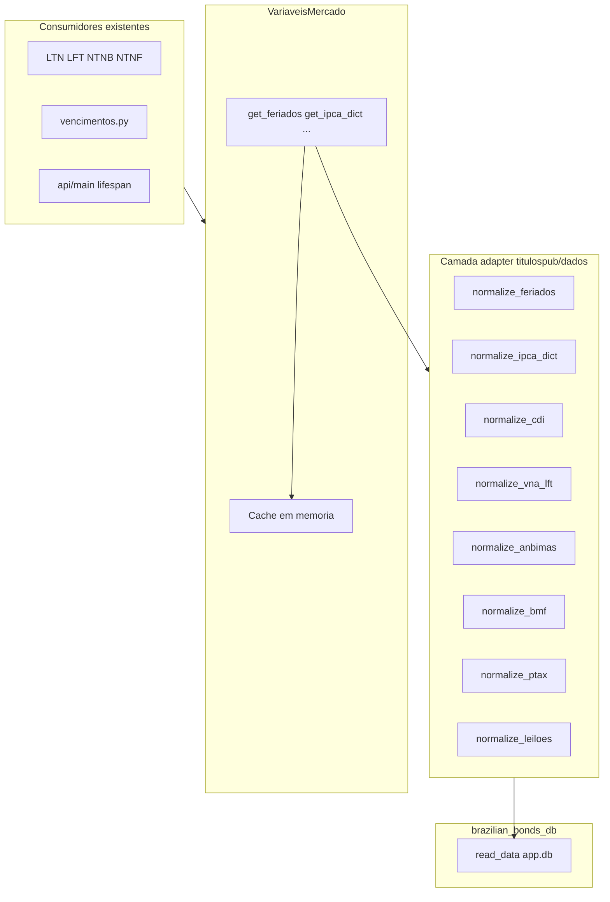

# Spec 002 — Refatoração `VariaveisMercado` (fonte: banco local)

| Campo        | Valor |
|--------------|-------|
| **ID**       | SPEC-002 |
| **Título**   | Refatorar `VariaveisMercado` para ler dados via `brazilian_bonds_db` |
| **Status**   | Implementado |
| **Autor**    | Rafael |
| **Criado**   | 2026-05-29 |
| **Depende de** | [Spec 001](../001-refatoracao-variaveis-mercado/001-refatoracao-variaveis-mercado.md) (suite de regressão verde) |
| **Escopo**   | `titulospub/dados/` (orquestrador e módulos de tratamento), ajustes mínimos em `api/` para `atualizar_tudo(data=...)` |

---

## 1. Contexto

A classe `VariaveisMercado` ([`titulospub/dados/orquestrador.py`](../../titulospub/dados/orquestrador.py)) hoje obtém dados via **scraping**, **cache pickle** (`titulospub/dados/cache_data/`) e **backups estáticos**.

Os dados passaram a ser materializados localmente pelo pacote **`brazilian_bonds_db`** (`bbdb`), com lake + SQLite:

```python
import brazilian_bonds_db as bbdb

bbdb.update(data_root=r"<repo_root>")
reader = bbdb.read_data(db_path=r"<repo_root>/database/app.db")

# Exemplos de leitura (ver pacote_test.ipynb)
reader.feriados.fetch_all()
reader.ipca_dict.fetch_on("2026-05-25")
reader.cdi.fetch_on("2026-05-25")
reader.vna.fetch_on("2026-05-25")
reader.mercado_com_liquidacoes.fetch_on("2026-05-25")
reader.ajustes_bmf.fetch_on("2026-05-25")
reader.ptax.fetch_on("2026-05-25")      # novo
reader.leiloes.fetch_on("2026-05-25")   # novo
```

**Objetivo desta spec:** trocar **apenas a origem dos dados** e o **tratamento/normalização** necessário para manter o **mesmo contrato público** congelado pela Spec 001. Fórmulas de títulos (`titulospub/core/`), rotas da API e Dash **não** mudam de comportamento.

**Data de referência para regressão:** `2026-05-25` (baseline em `tests/fixtures/`).

---

## ⚠️ Regra absoluta: contratos DEVEM ser mantidos

> **Esta refatoração altera somente a origem e o tratamento dos dados. O contrato público de cada `get_*()` é inviolável.**

| Permitido | Proibido |
|-----------|----------|
| Ler do `brazilian_bonds_db` em vez de scraping/cache | Renomear métodos públicos (`get_anbimas`, `get_bmf`, …) |
| Normalizar schema bruto do DB no adapter | Alterar tipos de retorno (`dict` → outro, `float` → `Series`, etc.) |
| Adicionar parâmetro **opcional** `data` onde a spec prevê (ex.: `get_cdi`) | Remover ou renomear chaves esperadas (`LTN`, `NTN-B`, `DI`, …) |
| Adicionar métodos novos (`get_ptax`, `get_leiloes`) | Mudar colunas consumidas downstream (`VENCIMENTO`, `PU`, `ADJ`, …) |
| Ajustar `atualizar_tudo(data)` e propagar `data` na API | “Consertar” consumidores (`vencimentos.py`, títulos, API) para adaptar a um contrato novo |
| Atualizar fixtures/golden **com justificativa** se normalização intencional | Fazer testes passarem alterando fórmulas em `titulospub/core/` |

**Fonte de verdade do contrato:** [Spec 001 §4](../001-refatoracao-variaveis-mercado/001-refatoracao-variaveis-mercado.md) + baseline em `tests/fixtures/variaveis_mercado/` e `tests/fixtures/golden/`.

**Gate obrigatório:** ao final de **cada** task, `pytest tests/ -m regression -v` deve passar **sem rede**. Se um teste falhar, corrigir o **adapter/normalização** — não o contrato nem os consumidores.

---

## 2. Princípios

1. **Contrato público OBRIGATORIAMENTE preservado** — tipos, chaves, colunas e formatos de retorno de cada `get_*()` permanecem **idênticos** ao documentado na Spec 001 §4 e validados pelos testes de regressão. Mudança de contrato **não** é escopo desta spec.
2. **Adapter absorve a diferença do DB** — se o schema do `reader` difere do scraping, a normalização ocorre em `titulospub/dados/` (orquestrador ou módulo dedicado), nunca nos consumidores.
3. **Uma variável por PR/task** — cada `get_*` é refatorado isoladamente; ao final de cada task, `pytest tests/ -m regression` deve passar.
4. **Tratamento explícito por variável** — o mapeamento bruto do `reader` → formato consumido pelo sistema é **documentado na task** correspondente em [`tasks.md`](tasks.md).
5. **`data` explícita em atualizações forçadas** — `atualizar_tudo(data)` passa a exigir data; todos os `get_*` com `force_update=True` usam essa data (não `today()` implícito).
6. **Scraping legado** — **isolado** em `titulospub/scraping/` (não removido); fallback opt-in via `VM_ALLOW_SCRAPING_FALLBACK` quando o DB estiver indisponível.

---

## 3. Escopo

### 3.1 Incluído

| Área | Alteração |
|------|-----------|
| `titulospub/dados/orquestrador.py` | Integrar `reader` do `bbdb`; delegar leitura; manter cache em memória |
| `titulospub/dados/*.py` | Adaptar/normalizar dados do DB (por variável, conforme tasks) |
| `get_ptax()`, `get_leiloes()` | **Novos** métodos públicos no orquestrador |
| `api/main.py`, `api/utils.py` | Propagar `data` para `atualizar_tudo(data=...)` no lifespan e `/atualizar-mercado` |
| `requirements.txt` / deps | Adicionar `brazilian_bonds_db` |
| Testes Spec 001 | Devem continuar verdes; atualizar fixtures **somente** com justificativa documentada |

### 3.2 Fora de escopo

- Alterar fórmulas financeiras em `titulospub/core/`
- Mudar contratos Pydantic ou rotas da API (exceto assinatura interna de admin se necessário)
- Refatorar `dash_app/` (continua via HTTP)
- Reescrever o pipeline lake/bronze/silver do `bbdb` (consumimos o DB já materializado)
- CI (Spec 001 Fase 6) — pode ser feito em PR separado

---

## 4. Contrato público (inalterado + extensões)

> **Todos os métodos existentes abaixo DEVEM continuar retornando exatamente o mesmo formato** que a Spec 001 congelou. A refatoração só troca *de onde* vêm os dados brutos e *como* são normalizados até esse formato.

### 4.1 Métodos existentes — retorno esperado

| Método | Retorno (contrato Spec 001) | Nova fonte bruta (`reader`) |
|--------|----------------------------|----------------------------|
| `get_feriados(force_update=False)` | `list` de datas | `reader.feriados.fetch_all()` — **sem parâmetro de data** |
| `get_ipca_dict(data=None, feriados=None, force_update=False)` | `dict` (chaves IPCA) | `reader.ipca_dict.fetch_on(data)` |
| `get_cdi(data=None, force_update=False)` | `float` | `reader.cdi.fetch_on(data)` — **adicionar parâmetro `data`** na assinatura |
| `get_vna_lft(data=None, force_update=False)` | `float` (VNA LFT) | `reader.vna.fetch_on(data)` |
| `get_anbimas(data=None, force_update=False)` | `dict[str, pd.DataFrame]` (`LTN`, `NTN-B`, `NTN-F`, `LFT`) | `reader.mercado_com_liquidacoes.fetch_on(data)` |
| `get_bmf(data=None, force_update=False)` | `dict[str, pd.DataFrame]` (`DI`, `DAP`) | `reader.ajustes_bmf.fetch_on(data)` |
| `atualizar_tudo(data, verbose=True)` | side-effect | orquestra todos os `get_*` com `force_update=True` e **`data` obrigatória** |
| `limpar_cache()` | side-effect | limpa cache em memória (+ pickles legados até remoção final) |

### 4.2 Métodos novos

| Método | Retorno (a definir na task) | Fonte bruta |
|--------|----------------------------|-------------|
| `get_ptax(data=None, force_update=False)` | TBD na task T-015 | `reader.ptax.fetch_on(data)` |
| `get_leiloes(data=None, force_update=False)` | TBD na task T-016 | `reader.leiloes.fetch_on(data)` |

> **Nota:** contratos de `get_ptax` e `get_leiloes` serão especificados nas tasks T-015/T-016 antes da implementação. Métodos **novos** — não podem quebrar a suite de regressão existente.

### 4.3 Contratos críticos para consumidores (não alterar)

Estes consumidores **não** serão refatorados nesta spec. Os adapters **DEVEM** manter os contratos abaixo.

#### [`titulospub/dados/vencimentos.py`](../../titulospub/dados/vencimentos.py)

| Função em `vencimentos.py` | Depende de | Contrato que **DEVE** ser mantido |
|----------------------------|------------|-----------------------------------|
| `get_vencimentos_ltn/lft/ntnb/ntnf()` | `get_anbimas()` | `dict` com chaves **exatas** `LTN`, `LFT`, `NTN-B`, `NTN-F` (inclui hífen em `NTN-B`) |
| ↑ | ↑ | Cada DataFrame com coluna **`VENCIMENTO`** (`datetime64`); `unique()` produz listas do golden `vencimentos_baseline.json` |
| `get_codigos_di_disponiveis()` | `get_bmf()` | `dict["DI"]` com coluna **`DI`** (códigos `DI1F27`, …); contagem baseline: **47** |
| `get_todos_vencimentos()` | funções acima | Mesmo contrato composto |

**Baseline de vencimentos** (`tests/fixtures/golden/vencimentos_baseline.json`, `data_base=2026-05-25`):

| Título | Qtd vencimentos |
|--------|-----------------|
| LTN | 12 |
| LFT | 17 |
| NTN-B | 15 |
| NTN-F | 6 |

Se o adapter retornar chaves erradas, colunas ausentes ou universo incompleto, `vencimentos.py` **não lança exceção** — retorna `[]` e a UI/API ficam vazias. Os testes **`test_vencimentos_regressao`** e **`test_vencimentos_endpoint`** detectam a regressão.

#### Outros consumidores dependentes do mesmo contrato

| Consumidor | Depende de |
|------------|------------|
| `titulospub/core/*` (LTN, LFT, NTN-B, NTN-F) | `get_anbimas`, `get_bmf`, `get_ipca_dict`, `get_cdi`, `get_vna_lft`, `get_feriados` |
| `api/routers/vencimentos.py` | funções de `vencimentos.py` |
| `titulospub/core/carteiras/*` | `get_vencimentos_*` |
| API títulos + equivalência | outputs numéricos via VM (golden Spec 001 Camada 3) |

#### Esquemas mínimos (Spec 001 §4.1 / §4.2 — inalterados)

**`get_anbimas()`** — cada DataFrame: colunas `TITULO`, `DATA`, `VENCIMENTO`, `ANBIMA`, `PU`; datas `datetime64`; `ANBIMA` e `PU` numéricos.

**`get_bmf()`** — cada DataFrame (`DI`, `DAP`): colunas `DATA`, `DATA_VENCIMENTO`, `<DI|DAP>`, `ADJ`; ordenação por `DATA_VENCIMENTO` ascendente.

### 4.4 Regra de `data`

| Situação | Comportamento |
|----------|---------------|
| Chamada normal (`force_update=False`) | Mantém cache em memória; se vazio, carrega do DB usando `data` informada ou fallback documentado na task |
| `force_update=True` | **`data` obrigatória** (via argumento do `get_*` ou propagada por `atualizar_tudo(data)`) |
| `atualizar_tudo(data)` | **`data` obrigatória**; repassa a mesma data a todos os `get_*` dependentes de data |
| `get_feriados` | Não usa `data` na leitura do DB; cache independente de data |
| `get_anbimas()` / `get_bmf()` — data informada **≠ hoje** | Usa a **própria data** no `fetch_on` / scraping |
| `get_anbimas()` / `get_bmf()` — data = **hoje** ou `data is None` | **D-1 útil** (`_data_leitura_mercado_sessao`) |
| `get_cdi()` / `get_ipca_dict()` / `get_vna_lft()` | Data literal (ou `today()` se `data is None`); **sem** D-1 automático |
| `resolver_data_mercado` (API) | Retorna data informada ou `today()`; D-1 de ANBIMA/BMF só dentro do orquestrador |

---

## 5. Arquitetura alvo



**Responsabilidades:**

- **`reader`** — leitura bruta por domínio (`fetch_all` / `fetch_on`).
- **Módulos `titulospub/dados/<variavel>.py`** — normalização para o formato do baseline Spec 001.
- **`orquestrador.py`** — orquestração, cache, `force_update`, `atualizar_tudo(data)`.

---

## 6. Mapeamento origem → método (referência)

| Task | Método VM | Fonte `reader` | Usa `data`? | Módulo de tratamento atual |
|------|-----------|----------------|-------------|----------------------------|
| T-003 | `get_feriados` | `feriados.fetch_all()` | Não | [`transforms/feriados.py`](../../titulospub/dados/transforms/feriados.py) — `transform_feriados` |
| T-004 | `get_ipca_dict` | `ipca_dict.fetch_on(data)` | Sim | [`transforms/ipca.py`](../../titulospub/dados/transforms/ipca.py) — `dicionario_ipca` |
| T-005 | `get_cdi` | `cdi.fetch_on(data)` | Sim | (inline — hoje só float) |
| T-006 | `get_vna_lft` | `vna.fetch_on(data)` | Sim | [`transforms/vna_lft.py`](../../titulospub/dados/transforms/vna_lft.py) — `transform_vna_lft` |
| T-007 | `get_anbimas` | `mercado_com_liquidacoes.fetch_on(data)` | Sim | [`transforms/anbimas.py`](../../titulospub/dados/transforms/anbimas.py) — `anbimas()` |
| T-008 | `get_bmf` | `ajustes_bmf.fetch_on(data)` | Sim | [`transforms/bmf.py`](../../titulospub/dados/transforms/bmf.py) — `ajustes_bmf` |
| T-009 | `get_ptax` | `ptax.fetch_on(data)` | Sim | **novo** |
| T-010 | `get_leiloes` | `leiloes.fetch_on(data)` | Sim | **novo** |

O **tratamento detalhado** (colunas de entrada do DB, transformações, fallbacks) será preenchido em cada task em [`tasks.md`](tasks.md) no momento da implementação.

---

## 7. Configuração

**Fonte primária:** arquivo `.env` na raiz do repositório (copiar de [`.env.example`](../../.env.example)). Variáveis já definidas no shell/OS têm precedência (`override=False` no `load_dotenv`).

| Variável / config | Default (sem `.env`) | Uso |
|-------------------|----------------------|-----|
| `BBDB_DATA_ROOT` | raiz do repositório | `bbdb.update(data_root=...)` |
| `BBDB_DB_PATH` | `<repo>/database/app.db` | `bbdb.read_data(db_path=...)` |

Implementação: [`titulospub/dados/db_reader.py`](../../titulospub/dados/db_reader.py) — `get_repo_root()`, `get_db_path()`, `get_reader()` (lazy singleton). **Sem** hardcode de path no orquestrador.

---

## 8. Critério de aceite por task (DoD)

Cada task em [`tasks.md`](tasks.md) só está concluída quando:

1. Implementação merged no escopo da task.
2. **`pytest tests/ -m regression -v`** passa **offline** (< 2 min).
3. **Contrato público preservado** — outputs byte-a-byte equivalentes ao baseline Spec 001 para `data=2026-05-25` (Camadas 1, 2 e 3).
4. Se baseline precisar mudar: **justificativa explícita no PR** + regeneração documentada de fixtures (`scripts/export_*`). Mudança de contrato **sem** justificativa = task **rejeitada**.

### 8.1 Checkpoint final (Spec 002 completa)

- [x] Todos os `get_*` existentes leem do DB (scraping não é caminho principal).
- [x] `get_ptax` exposto e documentado; **`get_leiloes` cancelado** (fora de escopo).
- [x] `atualizar_tudo(data)` obrigatório; API repassa data corretamente.
- [x] `pytest tests/ -m regression` verde (Fase 3).
- [x] Spec 001 Fase 7 parcial (T-048–T-051; T-052–T-053 na Fase 4).
- [x] Scraping isolado para backup/fallback (T-021–T-026); `cache_data/` opcional via `VM_PERSIST_DISK_CACHE`.

---

## 9. Riscos e mitigações

| Risco | Mitigação |
|-------|-----------|
| Schema do DB difere do scraping | Adapter por variável; comparar com baseline Spec 001; **não** alterar consumidores |
| Quebra silenciosa em `vencimentos.py` (listas vazias) | T-013/T-014: checklist de chaves/colunas; `test_vencimentos_regressao` obrigatório |
| `fetch_on` sem dado para data pedida | Task documenta fallback (última data disponível ou erro explícito) |
| `get_cdi` hoje sem `data` | Adicionar `data=None` opcional; assinatura compatível; contrato de retorno `float` inalterado |
| Testes mockam scraping | Atualizar `patch_variaveis_mercado_io` / fixtures para mockar `reader` quando necessário |
| DB ausente no CI | Testes de regressão continuam offline com pickles (Spec 001); testes de integração DB = `slow` |
| PTAX/leiloes sem consumidor ainda | Expor métodos; testes de contrato mínimos; **não** quebrar regressão existente |
| Tentação de “ajustar” `vencimentos.py` ou títulos | **Proibido** — corrigir normalização no adapter |

---

## 10. Referências

| Artefato | Caminho |
|----------|---------|
| Orquestrador atual | [`titulospub/dados/orquestrador.py`](../../titulospub/dados/orquestrador.py) |
| Notebook integração bbdb | [`pacote_test.ipynb`](../../pacote_test.ipynb) |
| Suite regressão | [`tests/`](../../tests/), Spec 001 |
| Baseline pickles | [`tests/fixtures/variaveis_mercado/`](../../tests/fixtures/variaveis_mercado/) |
| Golden JSON | [`tests/fixtures/golden/`](../../tests/fixtures/golden/) |

---

## 11. Histórico

| Versão | Data | Autor | Descrição |
|--------|------|-------|-----------|
| 0.1 | 2026-05-29 | Rafael | Proposta inicial — fonte bbdb, tasks por variável |
| 0.2 | 2026-05-29 | Rafael | Regra absoluta de contrato; consumidores críticos (`vencimentos.py`) |
| 0.3 | 2026-05-29 | Rafael | Fase 1 implementada — `atualizar_tudo(data)`, `get_cdi(data)`, API `resolver_data_mercado` |
| 0.4 | 2026-06-01 | Rafael | Fase 3 concluída — baseline/golden validados; T-016 leilões cancelada |
| 0.5 | 2026-06-01 | Rafael | Fase 4 — scraping isolado, fallback opt-in, backup_snapshots |
