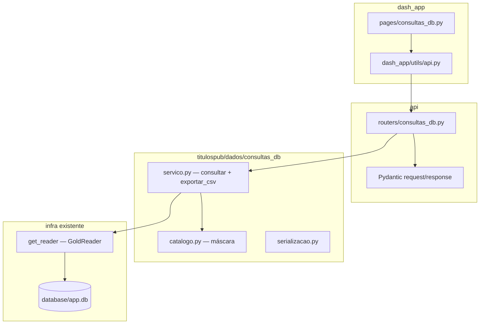

# Spec 003 — Explorer de consultas ao banco (API + Dash)

| Campo | Valor |
|-------|-------|
| **ID** | SPEC-003 |
| **Título** | Consulta interativa ao SQLite gold via máscara de domínio, API fina e tela Dash dedicada |
| **Status** | Implementado |
| **Autor** | — |
| **Criado** | 2026-06-01 |
| **Depende de** | [Spec 002](../002-refatoracao-variaveis-mercado-db/002-refatoracao-variaveis-mercado-db.md) (`get_reader()`, `BBDB_DB_PATH`, pipeline `bbdb`) |
| **Escopo** | `titulospub/dados/consultas_db/`, `api/routers/consultas_db.py`, `api/models.py`, `dash_app/pages/consultas_db.py`, testes novos |
| **Fora de escopo** | Alterar `VariaveisMercado`, transforms de cálculo, fórmulas em `titulospub/core/`, carteiras, rotas de títulos, autenticação multi-tenant |

---

## 1. Contexto

### 1.1 Situação atual

O projeto possui três camadas bem definidas ([`README.md`](../../README.md)):

- **`titulospub/`** — domínio: cálculos e dados de mercado para títulos.
- **`api/`** — FastAPI stateless: valida HTTP, delega ao domínio.
- **`dash_app/`** — UI: consome **somente** a API via HTTP.

Após a Spec 002, as variáveis de mercado usadas nos cálculos são lidas do SQLite materializado pelo pacote **`brazilian_bonds_db`** (`bbdb`), via factory [`titulospub/dados/db_reader.py`](../../titulospub/dados/db_reader.py):

```python
from titulospub.dados.db_reader import get_reader

reader = get_reader()  # GoldReader lazy singleton (thread-safe)
reader.cdi.fetch_on("2026-05-25")
reader.mercado_com_liquidacoes.fetch_range("2026-01-01", "2026-05-25")
```

O `GoldReader` (repositório irmão `brazil_fixed_income_analytics`) expõe, por tabela gold:

| API do reader | Uso típico |
|---------------|------------|
| `fetch_on(date)` | Um dia |
| **`fetch_range(start, end)`** | Intervalo inclusivo `YYYY-MM-DD` |
| `fetch_latest(n)` | Últimos `n` dias distintos de referência |
| `fetch_all()` | Snapshot completo |

Tabelas estáticas (`feriados`, `titulos_publicos`, `contratos_bmf`) suportam apenas **`fetch_all()`** — `fetch_range` levanta `TypeError` no reader.

Hoje **não existe** endpoint nem tela para o usuário explorar o banco de forma ad hoc (escolher tabela, colunas e período). O fluxo de cálculo (`VariaveisMercado`, transforms ANBIMA/BMF) normaliza dados para o contrato dos títulos — formato diferente do gold bruto exibido em um explorer.

### 1.2 Necessidade de negócio

Usuários e operadores precisam:

1. **Ler** o histórico persistido no `app.db` sem disparar cálculos de título.
2. **Escolher** qual tabela gold consultar e quais colunas visualizar.
3. **Filtrar** por intervalo de datas quando a fonte for série temporal.
4. **Exportar CSV** do mesmo recorte exibido na tela.

Isso é funcionalidade de **produto** (transparência de dados, auditoria, suporte), separada do motor de cálculo.

### 1.3 Objetivo desta spec

Entregar um **explorer de consultas DB** com:

- Módulo de domínio **`titulospub/dados/consultas_db/`** que concentra **toda a lógica** (máscara/catálogo, leitura, projeção de colunas, limites, exportação CSV).
- API **sem lógica de negócio** — apenas validação estrutural Pydantic e delegação.
- **Tela Dash dedicada** (`/consultas-db`) que conversa **exclusivamente** com a API.
- **Download CSV** implementado no módulo de consulta (domínio), exposto pela API, acionado pelo Dash.

---

## 2. Princípios e regras absolutas

| Obrigatório | Proibido |
|-------------|----------|
| Dash → API → `consultas_db` → `get_reader()` | Dash importar `titulospub` ou chamar módulo de cálculo |
| Toda regra de consulta no domínio (`consultas_db`) | Lógica de consulta em `api/routers/` |
| Máscara (catálogo) com whitelist de tabelas e colunas | SQL ou nomes de coluna livres vindos do cliente |
| CSV gerado em `exportar_csv()` no domínio | Dash montar CSV com regras duplicadas |
| Fluxo independente de `VariaveisMercado` e `transforms/*` | Reutilizar `transform_anbimas` / `transform_bmf` neste explorer |
| Testes de regressão Spec 001/002 permanecem verdes | Alterar contratos de cálculo, vencimentos ou fórmulas |

> **Separação de fluxos:** cálculo de títulos (`titulospub/core`, `orquestrador`) ≠ leitura exploratória do gold (`consultas_db`).

---

## 3. Arquitetura alvo



### 3.1 Responsabilidades por camada

| Camada | Responsabilidade |
|--------|------------------|
| **`catalogo.py` (máscara)** | Metadados: id da tabela, rótulo UI, atributo do `GoldReader`, modo (`range` / `snapshot`), coluna de data, colunas permitidas, colunas padrão, descrição |
| **`servico.py`** | Validar pedido contra máscara; chamar `fetch_range` / `fetch_all`; projetar colunas; aplicar limites; montar preview |
| **`exportar_csv()`** | Mesmo pipeline de leitura de `consultar`, sem truncar preview; retornar `bytes` + nome de arquivo |
| **`serializacao.py`** | `DataFrame` → `list[dict]` JSON-safe (datas ISO, NaN → `null`) |
| **`api/routers/consultas_db.py`** | Endpoints finos; traduz exceções de domínio em HTTP |
| **`dash_app/pages/consultas_db.py`** | UI: tabela, colunas, datas, tabela de preview, botão download |

### 3.2 O que a API **não** faz

- Não escolhe colunas nem chama `fetch_range`.
- Não gera CSV.
- Não mantém estado entre requisições.
- Pydantic valida apenas **forma** (tipos, listas não vazias); regras de negócio ficam no domínio.

---

## 4. Módulo de domínio — `titulospub/dados/consultas_db/`

### 4.1 Estrutura de arquivos

```text
titulospub/dados/consultas_db/
├── __init__.py          # API pública: listar_catalogo, consultar, exportar_csv
├── catalogo.py          # máscara estática (whitelist)
├── servico.py           # orquestração e limites
├── serializacao.py      # DataFrame → JSON
└── excecoes.py          # TabelaDesconhecidaError, ColunasInvalidasError, BancoIndisponivelError, ...
```

**Não** implementar em `orquestrador.py` nem em `transforms/` — caminho de leitura exploratória apenas.

### 4.2 Máscara (catálogo)

Cada **fonte consultável** é descrita por um registro imutável (ex.: `FonteConsulta` dataclass):

| Campo | Descrição |
|-------|-----------|
| `id` | Identificador estável na API/UI (ex.: `"cdi"`) |
| `rotulo` | Nome amigável na Dash |
| `reader_attr` | Atributo do `GoldReader` (ex.: `"cdi"`) |
| `modo` | `"range"` ou `"snapshot"` |
| `coluna_data` | Coluna para filtro temporal (`"data_referencia"`, `"data"`, ou `None`) |
| `colunas` | Tupla whitelist — únicas colunas que o usuário pode pedir |
| `colunas_padrao` | Subconjunto pré-marcado na UI |
| `descricao` | Texto de ajuda opcional |

**Fontes v1**

| `id` | `reader_attr` | `modo` | `coluna_data` | Notas |
|------|---------------|--------|---------------|-------|
| `cdi` | `cdi` | `range` | `data_referencia` | |
| `ptax` | `ptax` | `range` | `data_referencia` | |
| `ipca_dict` | `ipca_dict` | `range` | `data_referencia` | Muitas colunas IPCA |
| `vna` | `vna` | `range` | `data_referencia` | Várias linhas por dia |
| `ajustes_bmf` | `ajustes_bmf` | `range` | `data_referencia` | Gold inclui `data_vencimento` |
| `mercado_secundario` | `mercado_secundario` | `range` | `data_referencia` | Alto volume |
| `liquidacoes_mercado` | `liquidacoes_mercado` | `range` | `data_referencia` | Alto volume |
| `mercado_com_liquidacoes` | `mercado_com_liquidacoes` | `range` | `data_referencia` | Join full outer |
| `leiloes` | `leiloes` | `range` | `data_referencia` | |
| `feriados` | `feriados` | `snapshot` | `data` | `fetch_all`; filtro opcional por range em memória |
| `titulos_publicos` | `titulos_publicos` | `snapshot` | — | Sem `data_referencia`; UI oculta range |
| `contratos_bmf` | `contratos_bmf` | `snapshot` | — | Idem |

As colunas da máscara devem estar alinhadas ao schema gold v2 do `bbdb` (referência: `app/database/schema.py` no repositório `brazil_fixed_income_analytics`). Ao migrar schema no `bbdb`, atualizar `catalogo.py` na mesma entrega.

**Colunas por fonte (referência schema v2)**

| Fonte | Colunas (`colunas`) |
|-------|---------------------|
| `cdi` | `data_referencia`, `cdi` |
| `ptax` | `data_referencia`, `ptax_compra`, `ptax_venda` |
| `vna` | `data_referencia`, `codigo_selic`, `tipo_correcao`, `index`, `data_validade`, `vna`, `vna_ajustado` |
| `ipca_dict` | Conforme `IPCA_DICT_COLUMNS` no materializer `bbdb` (documentar na implementação de T-002) |
| `ajustes_bmf` | `ticker`, `data_referencia`, `data_vencimento`, `taxa_ajuste`, `quantidade_ajuste` |
| `mercado_secundario` | `tipo_titulo`, `data_vencimento`, `data_referencia`, `taxa_anbima`, `intervalo_min_d0`, `intervalo_max_d0`, `intervalo_min_d1`, `intervalo_max_d1`, `pu`, `expressao`, `data_base`, `codigo_selic`, `codigo_isin`, `taxa_compra`, `taxa_venda`, `desvio_padrao`, `status` |
| `liquidacoes_mercado` | `tipo_titulo`, `data_vencimento`, `data_referencia`, `qtd_operacoes`, `qtd_titulos`, `pu_medio`, `expressao`, `data_base`, `codigo_selic`, `codigo_isin`, `status` |
| `mercado_com_liquidacoes` | União das colunas de mercado + liquidações retornadas pelo SQL do reader (validar contra `fetch_on` em ambiente com DB) |
| `leiloes` | `numero_edital`, `tipo_titulo`, `data_vencimento`, `data_referencia`, `oferta`, `quantidade_aceita`, `percentual_corte`, `oferta_segunda_volta`, `financeiro_aceito`, `financeiro_aceito_segunda_volta`, `quantidade_aceita_segunda_volta`, `pu_medio`, `taxa_media` |
| `feriados` | `data` |
| `titulos_publicos` | `tipo_titulo`, `data_vencimento`, `expressao`, `data_base`, `codigo_selic`, `codigo_isin`, `status` |
| `contratos_bmf` | `ticker`, `codigo_isin`, `data_vencimento` |

### 4.3 API pública do módulo

```python
def listar_catalogo() -> list[dict]:
    """Retorna metadados de todas as fontes para a UI."""

def consultar(
    tabela: str,
    colunas: list[str],
    data_inicio: str | None = None,
    data_fim: str | None = None,
    *,
    limite_preview: int = 5000,
) -> ConsultaResultado:
    ...

def exportar_csv(
    tabela: str,
    colunas: list[str],
    data_inicio: str | None = None,
    data_fim: str | None = None,
) -> tuple[bytes, str]:
    """Retorna (conteúdo_csv, nome_arquivo_sugerido)."""
```

**`ConsultaResultado`** (dataclass ou TypedDict):

| Campo | Tipo | Descrição |
|-------|------|-----------|
| `tabela` | `str` | Id da fonte |
| `data_inicio` | `str \| None` | Eco do pedido |
| `data_fim` | `str \| None` | Eco do pedido |
| `colunas` | `list[str]` | Colunas efetivamente retornadas |
| `total_linhas` | `int` | Total após filtros (antes do truncamento de preview) |
| `truncado` | `bool` | `True` se preview cortou linhas |
| `rows` | `list[dict]` | Amostra para a DataTable |

### 4.4 Regras de `consultar`

1. Resolver `tabela` no catálogo → senão `TabelaDesconhecidaError`.
2. Validar `colunas`: não vazio, subconjunto de `fonte.colunas` → senão `ColunasInvalidasError`.
3. **Modo `range`:**
   - Exigir `data_inicio` e `data_fim` (`YYYY-MM-DD`).
   - Validar `data_inicio <= data_fim`; ajustar à interseção com min/max no banco (sem teto fixo de dias).
   - `getattr(get_reader(), fonte.reader_attr).fetch_range(inicio, fim)`.
4. **Modo `snapshot`:**
   - `fetch_all()`.
   - Se usuário informou `data_inicio`/`data_fim` e `coluna_data` não é `None`, filtrar linhas no pandas (`between` inclusivo).
5. Projetar `df[colunas]` (ordem respeitando pedido do usuário ou ordem do catálogo — definir na implementação e documentar).
6. **Preview:** se `len(df) > limite_preview`, retornar só as primeiras N linhas e `truncado=True`.
7. **Infra:** `FileNotFoundError` de `get_reader()` → `BancoIndisponivelError` com mensagem orientando `bbdb.update` e `.env`.

### 4.5 Regras de `exportar_csv`

- Reutilizar pipeline interno de leitura/filtro/projeção de `consultar` (**sem** limite de preview).
- Aplicar `limite_max_exportacao` (ex.: 500_000 linhas) — excedente → erro de domínio claro.
- Formato: CSV **UTF-8 com BOM** (`utf-8-sig`), separador `,`, datas `YYYY-MM-DD`, `na_rep=""`.
- Nome sugerido: `{tabela}_{data_inicio}_{data_fim}.csv` ou `{tabela}_snapshot.csv`.

### 4.6 Independência do módulo de cálculo

| Permitido importar | Proibido importar |
|--------------------|-------------------|
| `titulospub.dados.db_reader.get_reader` | `orquestrador`, `VariaveisMercado` |
| `pandas`, stdlib | `transforms/*`, `titulospub/core/*` |

Dados retornados são **gold bruto** (schema do `bbdb`), não o contrato ANBIMA (`LTN`, `PU`, etc.) usado nos títulos.

---

## 5. API HTTP — contrato

**Router:** `api/routers/consultas_db.py`  
**Prefixo:** `/consultas-db`  
**Tag OpenAPI:** `Consultas DB`

### 5.1 Endpoints

| Método | Rota | Corpo | Resposta | Delegação |
|--------|------|-------|----------|-----------|
| `GET` | `/consultas-db/catalogo` | — | `{ "fontes": [ ... ] }` | `listar_catalogo()` |
| `GET` | `/consultas-db/status` | — | `{ "db_path", "db_existe", ... }` | `get_db_path()` + verificação de arquivo |
| `POST` | `/consultas-db/consultar` | `ConsultaDbRequest` | `ConsultaHistoricoResponse` | `consultar(...)` |
| `POST` | `/consultas-db/exportar-csv` | `ConsultaDbRequest` | `text/csv` (attachment) | `exportar_csv(...)` |

**`ConsultaDbRequest` (Pydantic)**

```json
{
  "tabela": "cdi",
  "colunas": ["data_referencia", "cdi"],
  "data_inicio": "2024-01-01",
  "data_fim": "2024-12-31"
}
```

`POST` é preferível a `GET` porque a lista de colunas pode ser longa (`ipca_dict`).

**Mapeamento de erros**

| Exceção domínio | HTTP |
|-----------------|------|
| `TabelaDesconhecidaError` | 404 |
| `ColunasInvalidasError`, `ValueError` (datas/range) | 422 |
| `BancoIndisponivelError` | 503 |
| Limite de exportação excedido | 413 ou 422 (definir na implementação) |

**Export CSV (handler)**

```python
conteudo, nome = exportar_csv(...)
return Response(
    content=conteudo,
    media_type="text/csv; charset=utf-8",
    headers={"Content-Disposition": f'attachment; filename="{nome}"'},
)
```

Registrar router em [`api/main.py`](../../api/main.py) e documentar em `GET /`.

### 5.2 Modelos Pydantic

Adicionar em [`api/models.py`](../../api/models.py):

- `ConsultaDbRequest`
- `ConsultaHistoricoResponse` (espelha `ConsultaResultado`)
- `CatalogoConsultasResponse`
- `ConsultasDbStatusResponse`

---

## 6. Dash — tela dedicada

### 6.1 Arquivos e rota

| Item | Valor |
|------|-------|
| Página | [`dash_app/pages/consultas_db.py`](../../dash_app/pages/consultas_db.py) |
| Rota | `/consultas-db` |
| Config | `dash_app/config.py` → `PAGES["consultas_db"]` |
| Router | `dash_app/app.py` → `render_page` |

### 6.2 Componentes de UI

| Componente | Comportamento |
|------------|---------------|
| Dropdown **Tabela** | Opções de `GET /consultas-db/catalogo` (`id`, `rotulo`) |
| Checklist **Colunas** | Atualiza ao mudar tabela; default = `colunas_padrao` |
| **DatePickerRange** | Visível se `modo == "range"` ou snapshot com `coluna_data` |
| Botão **Consultar** | `POST /consultas-db/consultar` → `dash_table.DataTable` |
| Botão **Baixar CSV** | `POST /consultas-db/exportar-csv` → `dcc.Download` |
| Alertas | Erro 503 (banco ausente), aviso se `truncado=True`, aviso volume em tabelas grandes |

### 6.3 Cliente HTTP

Estender [`dash_app/utils/api.py`](../../dash_app/utils/api.py):

- `post_bytes(endpoint, payload, timeout=120)` para download CSV (resposta binária).

**Restrições:**

- Proibido `import titulospub` em `dash_app/`.
- Proibido reutilizar páginas de cálculo (LTN, LFT, …) para esta feature.
- Timeout maior que o padrão (15s) — consultas pesadas.

---

## 7. Limites, performance e operação

| Parâmetro | Valor sugerido | Onde |
|-----------|----------------|------|
| Preview máximo | 5 000 linhas | `consultar(limite_preview=...)` |
| Export máximo | 500 000 linhas | `exportar_csv` |
| Intervalo de datas | Interseção com min/max no SQLite | `disponibilidade.py` + `servico.py` |
| Timeout Dash → API | 120 s | `post` / `post_bytes` ou env `CONSULTAS_DB_TIMEOUT` |

**Tabelas de alto volume** (`mercado_com_liquidacoes`, `mercado_secundario`, `liquidacoes_mercado`): exibir aviso na UI quando o range > 30 dias.

**Multi-worker:** feature stateless; `get_reader()` é singleton thread-safe por processo. Compatível com vários workers Uvicorn (diferente de `/carteiras`, que usa memória local).

**Observabilidade:** [`api/middleware/metrics.py`](../../api/middleware/metrics.py) registrará latência em `/consultas-db/*`. Opcional: log estruturado no domínio com `tabela`, `total_linhas`, duração.

---

## 8. Configuração e dependências

| Variável | Uso |
|----------|-----|
| `BBDB_DB_PATH` | SQLite lido por `get_reader()` |
| `BBDB_DATA_ROOT` | Raiz do lake (materialização `bbdb.update`) |
| `API_BASE_URL` | Dash → API (já existente) |

Sem variáveis novas obrigatórias na v1. Limites podem virar env opcionais depois (`CONSULTAS_DB_MAX_RANGE_DAYS`, etc.).

**Dependência:** `brazilian_bonds_db` instalado (`-e ../brazil_fixed_income_analytics` em `requirements.txt`).

---

## 9. Testes

| Arquivo | Escopo |
|---------|--------|
| `tests/titulospub/dados/test_consultas_db.py` | Catálogo, whitelist, range vs snapshot, CSV, limites (mock `get_reader`) |
| `tests/api/test_consultas_db_endpoint.py` | `TestClient`, mock do domínio, 404/422/503 |

**Gate obrigatório** (não quebrar specs anteriores):

```bash
pytest tests/ -m regression -v
```

Testes de integração com `app.db` real: marker separado (`integration`), opcional em CI.

---

## 10. Critérios de aceite

- [x] Usuário escolhe tabela, colunas e range na tela `/consultas-db`.
- [x] Preview via `POST /consultas-db/consultar`; Dash sem lógica de consulta.
- [x] Download CSV do mesmo recorte via `POST /consultas-db/exportar-csv`.
- [x] CSV produzido somente por `exportar_csv()` no domínio.
- [x] Tabela/coluna fora da máscara → 422.
- [x] Banco ausente → 503 com mensagem acionável.
- [x] Nenhum `import titulospub` em `dash_app/`.
- [x] `pytest tests/ -m regression` verde.

---

## 11. Diagnóstico do sistema (levantamento Spec 003)

Pontos verificados no repositório em 2026-06-01:

### 11.1 Já alinhado

| Ponto | Evidência |
|-------|-----------|
| Dash não importa `titulospub` | Nenhum match em `dash_app/` |
| Factory do reader centralizada | [`db_reader.py`](../../titulospub/dados/db_reader.py) |
| `fetch_range` no `bbdb` | `DateSeriesTableReader` em `brazil_fixed_income_analytics` |
| Cliente HTTP Dash | [`dash_app/utils/api.py`](../../dash_app/utils/api.py) |
| CORS habilitado | [`api/main.py`](../../api/main.py) |

### 11.2 Riscos e cuidados na implementação

| # | Ponto | Ação na spec |
|---|--------|--------------|
| 1 | Snapshots sem `fetch_range` | Máscara `modo: snapshot`; UI adaptativa |
| 2 | Volume (`mercado_*`) | Limites + avisos na UI |
| 3 | API sem autenticação | Documentar risco; auth fora do escopo v1 |
| 4 | Injection via SQL | Apenas whitelist no catálogo |
| 5 | Schema `bbdb` evolui | Versionar `catalogo.py` com bump do `bbdb` |
| 6 | Explorer ≠ cache VM | Leitura direta do SQLite; dados podem existir no DB antes do cache de cálculo |
| 7 | Download inexistente na API | Novo endpoint `exportar-csv` |
| 8 | Cliente sem `post` binário | Novo helper `post_bytes` no Dash |

### 11.3 Fora de escopo v1 (evoluções)

- Paginação server-side no preview (`offset` / `limit`).
- Filtros adicionais (`tipo_titulo`, `ticker`).
- Autenticação / API key por cliente.
- Introspecção automática do catálogo a partir do SQLite (máscara estática é mais segura na v1).

---

## 12. Referências

- [Spec 002 — VariaveisMercado + DB](../002-refatoracao-variaveis-mercado-db/002-refatoracao-variaveis-mercado-db.md)
- [`titulospub/dados/db_reader.py`](../../titulospub/dados/db_reader.py)
- [`brazil_fixed_income_analytics` — `GoldReader`](../../brazil_fixed_income_analytics/src/app/database/readers/gold_reader.py) (repositório irmão)
- [`pacote_test.ipynb`](../../pacote_test.ipynb) — exemplos de leitura

---

## 13. Tasks

Ver [`tasks.md`](tasks.md) para lista ordenada de implementação.
