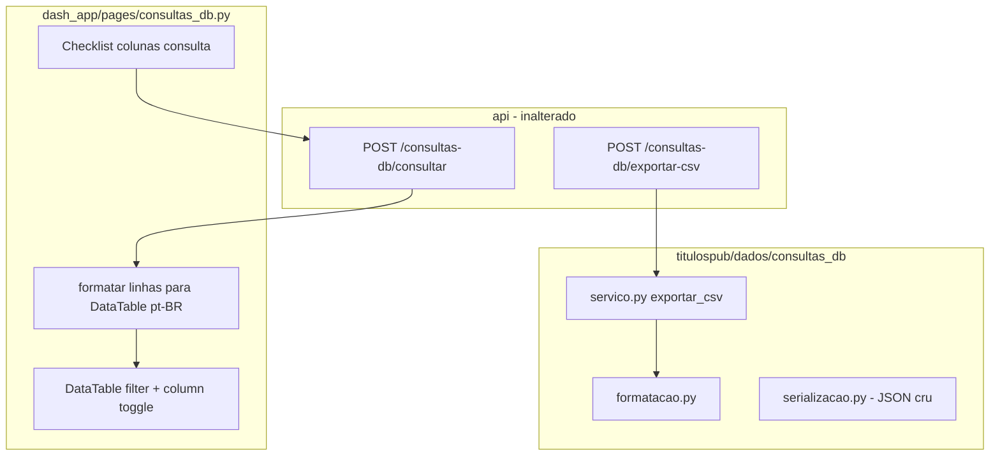

# Spec 004 — UX da página Consultas DB: formatação, tabela interativa e CSV legível

| Campo | Valor |
|-------|-------|
| **ID** | SPEC-004 |
| **Título** | Melhorias de apresentação, filtros na tabela e exportação CSV compatível com Excel (pt-BR) |
| **Status** | Implementado |
| **Autor** | — |
| **Criado** | 2026-06-01 |
| **Depende de** | [Spec 003](../003-consulta-db-explorer/003-consulta-db-explorer.md) (explorer funcional: API, domínio, Dash `/consultas-db`) |
| **Escopo** | `titulospub/dados/consultas_db/` (formatação/CSV), `dash_app/pages/consultas_db.py`, testes afetados |
| **Fora de escopo** | Novas fontes no catálogo, paginação server-side, filtros enviados à API, autenticação, alteração de cálculos ou `VariaveisMercado` |

---

## 1. Contexto

### 1.1 O que a Spec 003 entregou

A [Spec 003](../003-consulta-db-explorer/003-consulta-db-explorer.md) está **implementada** (ver checklist em [`tasks.md`](../003-consulta-db-explorer/tasks.md)):

| Capacidade | Estado |
|------------|--------|
| Domínio `titulospub/dados/consultas_db/` (catálogo, `consultar`, `exportar_csv`) | ✅ |
| API `/consultas-db/*` (catálogo, status, consultar, exportar-csv) | ✅ |
| Dash `/consultas-db` (tabela, checklist de colunas, período, preview, download) | ✅ |
| Whitelist de tabelas/colunas, limites de preview/export | ✅ |
| CSV no domínio: UTF-8 BOM, separador `,`, datas `YYYY-MM-DD` | ✅ |

Fluxo atual: o usuário escolhe **tabela** e **colunas** (checklist) **antes** da consulta; o preview usa `dash_table.DataTable` **sem** filtros por coluna nem ocultação de colunas na grade; números chegam da API como JSON numérico bruto (ex.: `0.123456`, `1234.5`) e são exibidos sem locale pt-BR.

### 1.2 Problemas relatados (motivação desta spec)

| # | Problema | Impacto |
|---|----------|---------|
| 1 | Números sem separador de milhar `.` e decimal `,` | Leitura difícil para operadores brasileiros |
| 2 | Tabela é apenas visualização passiva | Não dá para refinar o preview (esconder colunas, filtrar linhas por valor) sem nova consulta à API |
| 3 | CSV “não chega legível” no Excel | Arquivo com separador `,` e números em notação anglo-saxã costuma abrir em **uma coluna só** ou com colunas quebradas quando o Excel está em locale pt-BR (separador de lista `;`, decimal `,`) |

Esta spec trata **apenas** de apresentação e interação na UI + formato de exportação. O contrato HTTP da Spec 003 (`POST /consultas-db/consultar`, `POST /consultas-db/exportar-csv`) permanece; mudanças internas no domínio para CSV são permitidas desde que o endpoint e o payload do request não mudem.

### 1.3 Objetivo

1. **Exibição pt-BR:** todos os valores numéricos visíveis na página (tabela e metadados com contagem) usam **`.`** como separador de milhar e **`,`** como separador decimal.
2. **Tabela interativa:** após carregar o preview, o usuário pode **mostrar/ocultar colunas** e **filtrar linhas por coluna** sem nova ida à API.
3. **CSV legível no Excel (pt-BR):** cada campo em sua coluna ao abrir no Excel regional Brasil; números e datas formatados de forma previsível.

---

## 2. Princípios e regras absolutas

| Obrigatório | Proibido |
|-------------|----------|
| Formatação numérica pt-BR centralizada (domínio ou util compartilhado UI+CSV) | Dash importar `titulospub` |
| CSV gerado somente em `exportar_csv()` no domínio | Dash montar CSV com regras duplicadas |
| Filtros e seleção de colunas na grade = **client-side** (dados já em memória no browser) | Novos parâmetros de filtro na API nesta entrega |
| Manter arquitetura Dash → API → `consultas_db` | Alterar fórmulas, `VariaveisMercado`, rotas de títulos |
| `pytest tests/ -m regression` verde ao fechar | Quebrar whitelist ou contratos da Spec 003 |

> **Separação:** JSON da API pode continuar transportando números “crus” para precisão; a formatação pt-BR é responsabilidade da camada de apresentação (Dash) e do pipeline de exportação (domínio).

---

## 3. Requisitos funcionais

### 3.1 Formatação numérica pt-BR (RF-01)

**Regra:** na interface `/consultas-db`, todo valor exibido que seja **numérico** (inteiros e floats retornados pela consulta) deve ser renderizado no padrão brasileiro:

| Elemento | Exemplo entrada (JSON) | Exibição |
|----------|------------------------|----------|
| Decimal | `0.123456` | `0,123456` (ver §3.1.1 quanto a casas) |
| Milhar + decimal | `1234.567` | `1.234,567` |
| Inteiro grande | `1500000` | `1.500.000` |
| Zero | `0` | `0` |
| Nulo / ausente | `null` | célula vazia ou `—` (definir um único padrão na implementação) |

**Não formatar como número:**

- Colunas de **data** (`data_referencia`, `data`, `data_vencimento`, `data_base`, `data_validade`): manter `DD/MM/YYYY` ou `YYYY-MM-DD` conforme já serializado — preferir **`DD/MM/YYYY`** na tabela para consistência com o DatePicker.
- Colunas **texto** (`tipo_titulo`, `ticker`, `status`, `codigo_isin`, etc.): sem alteração.
- Identificadores que são numéricos mas semanticamente texto (ex.: `numero_edital`): tratar como texto se o catálogo ou heurística indicar; na dúvida, lista explícita por coluna no catálogo (evolução opcional).

#### 3.1.1 Casas decimais

| Tipo de coluna | Casas decimais sugeridas |
|----------------|--------------------------|
| Taxas, CDI, PTAX, percentuais (`cdi`, `taxa_*`, `ptax_*`, etc.) | Até **6** significativas ou fixar conforme coluna no catálogo |
| PU, financeiro, VNA | Até **6** ou **2** conforme coluna |
| Quantidades inteiras (`qtd_*`, `quantidade_*`) | **0** (sem parte decimal) |
| Padrão para demais floats | **6** casas, removendo zeros à direita após a vírgula |

A implementação deve usar uma função única, por exemplo `formatar_numero_pt_br(valor, casas_decimais=None)`, testável unitariamente.

#### 3.1.2 Metadados da página

Textos como `Exibindo 5.000 de 12.345 linhas` devem usar o mesmo locale (milhar `.`).

#### 3.1.3 Onde implementar

| Camada | Responsabilidade |
|--------|------------------|
| **`titulospub/dados/consultas_db/formatacao.py`** (novo) | Funções puras: `formatar_numero_pt_br`, `formatar_data_exibicao`, `formatar_dataframe_para_exibicao` (opcional), `formatar_dataframe_para_csv_pt_br` |
| **`dash_app/pages/consultas_db.py`** | Aplicar formatação ao montar `data` da `DataTable` e metadados |
| **API JSON** | Sem mudança obrigatória: `rows` continuam com números JSON nativos |

---

### 3.2 Tabela com seleção de colunas e filtros (RF-02)

**Comportamento desejado:** depois de **Consultar**, o usuário interage com a grade de preview:

| Recurso | Descrição |
|---------|-----------|
| **Ocultar / exibir colunas** | Controle na própria tabela (menu de colunas ou checkboxes acima da grade) para alternar visibilidade **sem** nova requisição |
| **Filtro por coluna** | Linha de filtro nativa (texto contém / igual) por coluna, estilo planilha |
| **Ordenação** | Clicar no cabeçalho para ordenar (já suportado pelo `dash_table`; habilitar se ainda não estiver) |

**Escopo client-side:**

- Os filtros aplicam-se apenas ao conjunto `rows` já retornado (até `limite_preview`, ex. 5 000 linhas).
- Exportar CSV continua usando o recorte da **consulta na API** (tabela, colunas do checklist, datas) — **não** o subconjunto filtrado na UI nesta v1 (documentar na UI: *“O CSV reflete a consulta completa; filtros da tabela são apenas para o preview.”*).

**Implementação recomendada (Dash):**

Estender `_montar_datatable` em [`dash_app/pages/consultas_db.py`](../../dash_app/pages/consultas_db.py):

```python
dash_table.DataTable(
  ...
  filter_action="native",
  sort_action="native",
  sort_mode="multi",
  column_selectable="multi",  # ou hidden_columns via dropdown dedicado
  ...
)
```

**UI complementar (recomendado):**

- Bloco **“Colunas visíveis no preview”** (`dcc.Checklist` ou `dbc.Checklist`) sincronizado com as colunas do resultado, permitindo marcar/desmarcar após a consulta (além do checklist pré-consulta).
- Tooltip ou texto de ajuda explicando a diferença entre colunas da **consulta** (enviadas à API) e colunas **visíveis** (só preview).

**Fora desta entrega:**

- Enviar filtros da grade para `POST /consultas-db/consultar`.
- Exportar apenas linhas filtradas na UI.

---

### 3.3 Exportação CSV legível no Excel pt-BR (RF-03)

**Problema atual:** `exportar_csv` usa `sep=","` e números sem locale (spec 003 §4.5). No Excel com configuração regional brasileira, o arquivo frequentemente não separa colunas corretamente.

**Formato alvo (v1 desta spec):**

| Aspecto | Valor |
|---------|--------|
| Encoding | UTF-8 com BOM (`utf-8-sig`) — mantido |
| Separador de campos | **`;`** (ponto e vírgula), padrão de lista do Excel pt-BR |
| Separador decimal nos números | **`,`** |
| Separador de milhar nos números | **`.`** |
| Datas | `DD/MM/YYYY` no CSV |
| Campos texto | Sempre entre aspas duplas se contiver `;`, `"` ou quebra de linha; escapar `"` como `""` |
| Valores ausentes | Campo vazio |
| Cabeçalho | Nomes das colunas na primeira linha (ids do catálogo ou rótulos — usar **ids** para compatibilidade com scripts; opcional segunda linha de rótulos fica fora do escopo) |

**Exemplo** (duas linhas de `cdi`):

```csv
data_referencia;cdi
01/01/2024;0,123456
02/01/2024;0,234567
```

**Pipeline:**

1. Reutilizar leitura/filtro/projeção existente de `exportar_csv`.
2. Aplicar `formatar_dataframe_para_csv_pt_br(df)` antes de `to_csv` (ou escrita manual com `csv` module para controle de quoting).
3. Não usar `float` formatado com `,` sem quoting em campos que possam ambiguidade — preferir formatação string estável por coluna.

**Download no Dash:** manter `post_bytes` + `dcc.Download`; `type` pode permanecer `text/csv` com charset implícito no BOM.

**Compatibilidade:**

- Excel Windows pt-BR: abertura duplo-clique com colunas corretas.
- LibreOffice / Google Sheets: usuário pode precisar indicar separador `;` na importação — aceitável; documentar no README.

---

## 4. Arquitetura alvo



### 4.1 Arquivos previstos

| Arquivo | Ação |
|---------|------|
| `titulospub/dados/consultas_db/formatacao.py` | **Criar** — funções de locale pt-BR |
| `titulospub/dados/consultas_db/servico.py` | **Alterar** — `exportar_csv` usa formatação pt-BR + `;` |
| `titulospub/dados/consultas_db/__init__.py` | Exportar helpers públicos se necessário para testes |
| `dash_app/pages/consultas_db.py` | **Alterar** — DataTable interativa + formatação células |
| `tests/titulospub/dados/test_consultas_db_formatacao.py` | **Criar** — casos de número, data, CSV |
| `tests/titulospub/dados/test_consultas_db.py` | **Atualizar** — asserts de CSV (`;`, vírgula decimal) |
| `README.md` | **Atualizar** — formato CSV e comportamento da tabela |

**Sem alteração obrigatória:** `api/models.py`, rotas, `ConsultaDbRequest`, catálogo de fontes.

---

## 5. Detalhamento Dash

### 5.1 Fluxo do usuário (atualizado)

```text
1. Escolhe tabela + colunas (consulta) + período
2. Clica Consultar → API retorna rows JSON
3. Dash formata números/datas para exibição pt-BR
4. Usuário filtra/ordena/oculta colunas na grade (client-side)
5. Clica Baixar CSV → API exporta recorte completo em CSV pt-BR (;)
```

### 5.2 Componentes novos ou alterados

| Componente | Alteração |
|------------|-----------|
| `consultas-db-tabela-container` | DataTable com `filter_action`, ordenação, controle de colunas visíveis |
| `consultas-db-colunas-preview` (novo, opcional id) | Checklist pós-consulta sincronizado com colunas do resultado |
| `consultas-db-meta` | Contagens formatadas pt-BR |
| Alerta truncado | Usar locale em números (`5.000` em vez de `5,000` do Python) |

### 5.3 Performance

- Formatação de até 5 000 linhas × N colunas no callback é aceitável em Python no servidor Dash; se lento, formatar só colunas numéricas detectadas por dtype após parse local.
- `virtualization=True` na DataTable mantida.

---

## 6. Detalhamento domínio — CSV

Substituir em `exportar_csv` (conceitual):

```python
# Antes (Spec 003)
df_export.to_csv(buffer, index=False, sep=",", na_rep="")

# Depois (Spec 004)
df_pt = formatar_dataframe_para_csv_pt_br(df)
# escrever com sep=";", quoting conforme necessário
```

Constantes sugeridas em `formatacao.py`:

```python
CSV_SEPARADOR_CAMPOS = ";"
CSV_ENCODING = "utf-8-sig"
```

---

## 7. Testes

| Arquivo | Casos |
|---------|--------|
| `tests/titulospub/dados/test_consultas_db_formatacao.py` | `formatar_numero_pt_br`: int, float, None, negativos, zeros à direita |
| | `formatar_data_exibicao` / datas CSV `DD/MM/YYYY` |
| `tests/titulospub/dados/test_consultas_db.py` | Atualizar `test_exportar_csv_bytes_e_bom`: header `data_referencia;cdi`, linhas com `;` e decimal `,` |
| | Snapshot de uma linha `mercado_secundario` com campo texto contendo vírgula (quoting) |
| Smoke manual | Abrir CSV no Excel pt-BR; preview com filtro e ocultar coluna |

**Gate:**

```bash
pytest tests/ -m regression -v
```

Testes de API (`test_consultas_db_endpoint.py`): ajustar mock de bytes CSV se o conteúdo esperado mudar.

---

## 8. Critérios de aceite

- [x] Na tela `/consultas-db`, valores numéricos exibem milhar com `.` e decimal com `,`.
- [x] Datas na tabela aparecem em formato `DD/MM/YYYY` (ou documentado se alguma coluna permanecer ISO).
- [x] Após consultar, o usuário pode filtrar por coluna na grade (filtro nativo).
- [x] Após consultar, o usuário pode ocultar/exibir colunas no preview sem nova consulta.
- [x] Texto na UI deixa claro que filtros da tabela não alteram o CSV.
- [x] CSV baixado abre no Excel (locale pt-BR) com **uma coluna por campo** e números legíveis (decimal `,`).
- [x] CSV continua gerado apenas em `exportar_csv()` no domínio.
- [x] Nenhum `import titulospub` em `dash_app/`.
- [x] `pytest tests/ -m regression` verde.

---

## 9. Riscos e decisões

| # | Risco | Mitigação |
|---|--------|-----------|
| 1 | Formatar números como string na DataTable impede ordenação numérica correta | Ordenar por valor numérico interno (`columns` com `type` + `format` do dash_table) ou aceitar ordenação lexicográfica na v1 e documentar |
| 2 | CSV `;` menos universal fora do Brasil | Documentar; manter números sem ambiguidade; BOM UTF-8 |
| 3 | Colunas mistas (texto que parece número) | Heurística por nome ou lista no catálogo em evolução futura |
| 4 | Regressão em consumidores que parseavam CSV com `,` | Breaking change aceito nesta spec; mencionar no README |

**Decisão v1:** preview com dados formatados como string para simplicidade; se a ordenação for prioridade, usar `dash_table.Format` com locale (avaliar na implementação).

---

## 10. Fora de escopo (evoluções futuras)

- Exportar apenas linhas/colunas visíveis no preview.
- Filtros server-side (`tipo_titulo`, `ticker`) na API.
- Escolha de locale EN/US no download.
- `dash-ag-grid` como substituto da DataTable.
- Alterar limite de preview ou paginação.

---

## 11. Referências

- [Spec 003 — Explorer consultas DB](../003-consulta-db-explorer/003-consulta-db-explorer.md)
- [`dash_app/pages/consultas_db.py`](../../dash_app/pages/consultas_db.py)
- [`titulospub/dados/consultas_db/servico.py`](../../titulospub/dados/consultas_db/servico.py)
- [Dash DataTable filtering](https://dash.plotly.com/datatable/filtering)
- [Dash DataTable columns](https://dash.plotly.com/datatable/columns)

---

## 12. Tasks

Ver [`tasks.md`](tasks.md) para lista ordenada de implementação.
